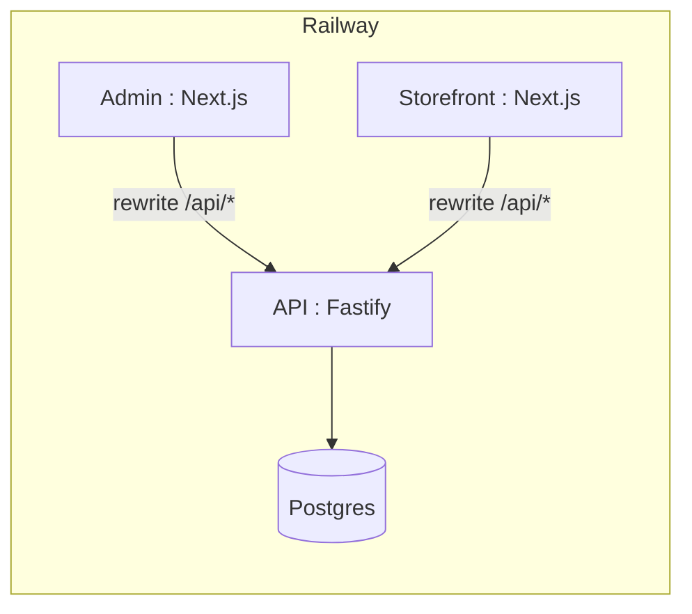

# Deploy ProductInfoMan on Railway

This guide deploys the PIM monorepo as **four Railway services** from one GitHub repo:

| Service | Package | Public URL |
|---------|---------|------------|
| **Postgres** | Railway plugin | internal only |
| **API** | `@productinfoman/api` | `https://api-….up.railway.app` |
| **Admin** | `@productinfoman/admin` | `https://admin-….up.railway.app` |
| **Storefront** | `@productinfoman/storefront` | `https://store-….up.railway.app` |

Redis and OpenSearch are **optional**. Without them the API runs workers in-process (`*_SYNC=true`) and uses an in-memory search index.

## 1. Create the Railway project

1. Open [railway.app](https://railway.app) → **New Project** → **Deploy from GitHub repo**.
2. Select this repository (`ProductInfoMan`).
3. **Do not** set a root directory on the project — keep the repo root so `pnpm-workspace.yaml` resolves.

## 2. Add PostgreSQL

1. In the project canvas: **+ New** → **Database** → **PostgreSQL**.
2. Railway provisions `DATABASE_URL` automatically.

## 3. Create the API service

If Railway auto-detected packages, rename/configure the API service. Otherwise:

1. **+ New** → **GitHub Repo** → same repo (empty service).
2. **Settings → General**
   - **Root Directory:** *(leave empty / repo root)*
   - **Config-as-code path:** `/apps/api/railway.toml`
3. **Settings → Variables**

```env
DATABASE_URL=${{Postgres.DATABASE_URL}}
HOST=0.0.0.0
IMPORT_SYNC=true
SEARCH_SYNC=true
PUBLISH_SYNC=true
EVENT_SYNC=true
```

4. Deploy. The API runs migrations on each deploy (`preDeployCommand`) then starts on `$PORT`.
5. Verify: `GET https://<api-domain>/health` → `{ "status": "ok" }`

## 4. Create the Admin service

1. **+ New** → same GitHub repo.
2. **Config-as-code path:** `/apps/admin/railway.toml`
3. **Variables** (replace `api` with your API service name):

```env
API_URL=https://${{api.RAILWAY_PUBLIC_DOMAIN}}
NEXT_PUBLIC_DEFAULT_ORG_SLUG=demo
```

> `API_URL` must be set **before the first build** so Next.js rewrites proxy `/api/*` to the backend.

4. Generate a public domain: **Settings → Networking → Generate Domain**.
5. Open `https://<admin-domain>/admin`

## 5. Create the Storefront service

1. **+ New** → same GitHub repo.
2. **Config-as-code path:** `/apps/storefront/railway.toml`
3. **Variables:**

```env
API_URL=https://${{api.RAILWAY_PUBLIC_DOMAIN}}
NEXT_PUBLIC_ORG_SLUG=demo
NEXT_PUBLIC_SITE_URL=https://${{storefront.RAILWAY_PUBLIC_DOMAIN}}
```

4. Generate a public domain and open the storefront home page.

## 6. Seed demo data (one-time)

After the API is healthy, open a **Railway shell** on the API service (or run locally against the Railway `DATABASE_URL`):

```bash
pnpm db:seed
pnpm seed:attributes-facets
pnpm seed:demo-catalog --no-reindex
```

Then trigger search indexing (with API running):

```bash
curl -X POST -H "X-Organization-Slug: demo" \
  "https://<api-domain>/api/v1/search/reindex"
```

Or redeploy with `SEARCH_SYNC=true` and run `pnpm seed:demo-catalog` without `--no-reindex`.

## 7. Optional: Redis

For production-grade job queues:

1. Add **Redis** from Railway marketplace.
2. On the API service:

```env
REDIS_URL=${{Redis.REDIS_URL}}
IMPORT_SYNC=false
SEARCH_SYNC=false
PUBLISH_SYNC=false
EVENT_SYNC=false
```

## CLI alternative

```bash
npm i -g @railway/cli
railway login
railway link          # pick project
railway up            # deploy current service
```

Use separate Railway services with config-as-code paths as above.

## Troubleshooting

| Symptom | Fix |
|---------|-----|
| `pnpm: command not found` | Ensure `packageManager` is set in root `package.json` (Corepack enables pnpm on Nixpacks). |
| Admin/Storefront 502 on `/api/*` | Set `API_URL` to the API **public** HTTPS URL and redeploy (rebuild required). |
| DB connection errors | Confirm `DATABASE_URL=${{Postgres.DATABASE_URL}}` on the API service. |
| Empty catalog | Run seed commands (step 6). |
| Search returns no facets | Run reindex after seeding. |

## Architecture



## Files

| File | Purpose |
|------|---------|
| `apps/api/railway.toml` | API build, migrate, start |
| `apps/admin/railway.toml` | Admin build/start |
| `apps/storefront/railway.toml` | Storefront build/start |
| `.env.railway.example` | Variable template |
| `.npmrc` | pnpm hoisting for Nixpacks |
