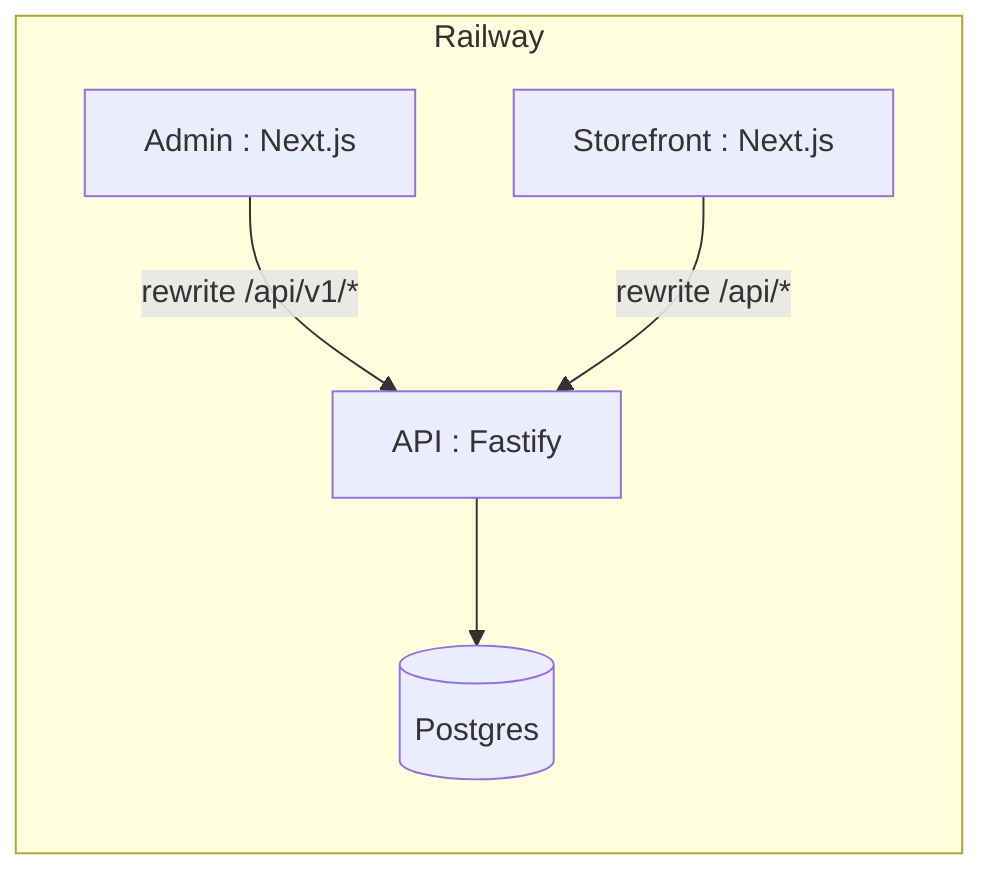

# Deploy ProductInfoMan on Railway

Deploy the PIM monorepo as **four Railway services** from one GitHub repo:

| Service | Config path | Public URL |
|---------|-------------|------------|
| **Postgres** | Railway plugin | internal |
| **API** | `/apps/api/railway.toml` | `https://api-….up.railway.app` |
| **Admin** | `/apps/admin/railway.toml` | `https://admin-….up.railway.app` |
| **Storefront** | `/apps/storefront/railway.toml` | `https://store-….up.railway.app` |

Redis and OpenSearch are optional. Without them the API runs workers in-process (`*_SYNC=true`) and uses an in-memory search index.

## Quick start checklist

1. Create Railway project from GitHub → **repo root** (not a subfolder).
2. Add **PostgreSQL**.
3. Deploy **API** first → generate public domain → verify `GET /health/ready`.
4. Deploy **Admin** with `API_URL` + matching `JWT_SECRET` → generate domain.
5. Deploy **Storefront** with `API_URL` → generate domain.
6. Run **seed** in API shell: `bash scripts/railway-seed.sh`.
7. Open `https://<admin-domain>/login`.

## 1. Create the Railway project

1. [railway.app](https://railway.app) → **New Project** → **Deploy from GitHub repo**.
2. Select `ProductInfoMan`.
3. Keep **Root Directory** empty (monorepo root).

## 2. Add PostgreSQL

**+ New** → **Database** → **PostgreSQL**. Railway sets `DATABASE_URL`.

## 3. API service

1. **+ New** → same GitHub repo (or configure auto-created service).
2. **Settings → Config-as-code** → `/apps/api/railway.toml`
3. **Variables** (generate `JWT_SECRET` once: `openssl rand -base64 48`):

```env
DATABASE_URL=${{Postgres.DATABASE_URL}}
HOST=0.0.0.0
JWT_SECRET=<your-48-char-secret>
IMPORT_SYNC=true
SEARCH_SYNC=true
PUBLISH_SYNC=true
EVENT_SYNC=true
ADMIN_EMAIL=admin@demo.local
ADMIN_PASSWORD=<strong-password-min-12-chars>
```

4. **Networking** → **Generate Domain**.
5. Deploy. Pre-deploy runs `prisma db push` to sync schema.
6. Verify: `GET https://<api-domain>/health/ready` → `{ "status": "ok", ... }`

After Admin/Storefront domains exist, add:

```env
CORS_ORIGINS=https://<admin-domain>,https://<storefront-domain>
```

## 4. Admin service

1. **+ New** → same repo.
2. **Config-as-code** → `/apps/admin/railway.toml`
3. **Variables** (`JWT_SECRET` must match API):

```env
API_URL=https://${{api.RAILWAY_PUBLIC_DOMAIN}}
JWT_SECRET=<same-as-api>
NEXT_PUBLIC_DEFAULT_ORG_SLUG=demo
NEXT_PUBLIC_ADMIN_EMAIL=admin@demo.local
```

> Set `API_URL` **before the first build** so Next.js rewrites `/api/v1/*` to the backend.

4. **Generate Domain**.
5. Open `https://<admin-domain>/login`

## 5. Storefront service

1. **+ New** → same repo.
2. **Config-as-code** → `/apps/storefront/railway.toml`
3. **Variables**:

```env
API_URL=https://${{api.RAILWAY_PUBLIC_DOMAIN}}
NEXT_PUBLIC_ORG_SLUG=demo
NEXT_PUBLIC_SITE_URL=https://${{storefront.RAILWAY_PUBLIC_DOMAIN}}
```

4. **Generate Domain**.

## 6. Seed demo data (one-time)

API service → **Shell**:

```bash
bash scripts/railway-seed.sh
```

Or manually:

```bash
pnpm db:seed
pnpm seed:attributes-facets
pnpm seed:demo-catalog
```

Sign in at Admin with `ADMIN_EMAIL` / `ADMIN_PASSWORD`.

## 7. Optional: Redis

For BullMQ job queues instead of in-process workers:

```env
REDIS_URL=${{Redis.REDIS_URL}}
IMPORT_SYNC=false
SEARCH_SYNC=false
PUBLISH_SYNC=false
EVENT_SYNC=false
```

## Service reference

| File | Purpose |
|------|---------|
| `apps/api/railway.toml` | API build, `db push`, start |
| `apps/admin/railway.toml` | Admin build/start |
| `apps/storefront/railway.toml` | Storefront build/start |
| `.env.railway.example` | Variable template |
| `scripts/railway-seed.sh` | Post-deploy seed script |

## Troubleshooting

| Symptom | Fix |
|---------|-----|
| API crash on start | Set `JWT_SECRET` (min 32 chars). |
| Admin **Unauthorized** after login | `JWT_SECRET` must match on API and Admin; redeploy Admin after setting it. |
| Admin 502 on `/api/v1/*` | Set `API_URL` to API **public HTTPS** URL; **rebuild** Admin. |
| DB errors | `DATABASE_URL=${{Postgres.DATABASE_URL}}` on API only. |
| Empty catalog | Run `bash scripts/railway-seed.sh` in API shell. |
| `pnpm: command not found` | Root `package.json` has `packageManager` — Corepack enables pnpm on Nixpacks. |

## Architecture



## CLI

```bash
npx @railway/cli login
npx @railway/cli link
# Per service, set config path in dashboard then:
npx @railway/cli up
```
