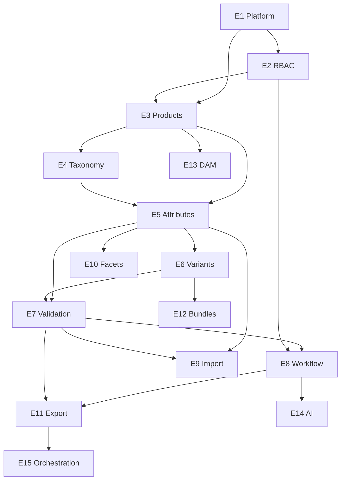

# Epics & Phased Delivery Plan

## Numbered Epic List

1. **E1 — Platform Foundation & Tenancy**
2. **E2 — Identity, Roles & Permissions**
3. **E3 — Product Master Data**
4. **E4 — Taxonomy & Category Hierarchy**
5. **E5 — Attribute Groups & Category Attribute Sets**
6. **E6 — Parent-Child & Variant Model**
7. **E7 — Validation Engine & Publish Readiness**
8. **E8 — Workflow, Approvals & Audit Trail**
9. **E9 — Import Pipeline (CSV + API)**
10. **E10 — Facet Generation Rules**
11. **E11 — Channel Export & Syndication**
12. **E12 — Bundles & Collections**
13. **E13 — DAM Integration**
14. **E14 — AI Enrichment & Automation**
15. **E15 — Advanced Multichannel Orchestration**

---

## Epic Details

### E1 — Platform Foundation & Tenancy

**Objective:** Establish the SaaS platform skeleton: monorepo, API service, database, job runner, configuration, and tenant isolation.

**Scope:**
- Monorepo scaffolding (TypeScript, lint, test, CI)
- PostgreSQL + migrations framework
- Tenant (Organization) entity and request scoping
- Health checks, structured logging, error handling
- Environment-based configuration
- Object storage hook for import files

**Dependencies:** None

**Acceptance Criteria:**
- [ ] New tenant can be provisioned with isolated data scope
- [ ] API returns tenant-scoped responses only
- [ ] CI pipeline runs lint, typecheck, and unit tests
- [ ] Local dev environment documented and reproducible

---

### E2 — Identity, Roles & Permissions

**Objective:** Secure the platform with authenticated users, role-based access, and permission checks on all mutations.

**Scope:**
- User registration/invite per tenant
- Roles: Admin, Catalog Manager, Editor, Reviewer, Viewer
- Permission matrix for product, taxonomy, import, publish actions
- API authentication (JWT or session tokens)
- Middleware enforcing permissions on routes

**Dependencies:** E1

**Acceptance Criteria:**
- [ ] Users can only access their tenant
- [ ] Editor cannot approve or publish without permission
- [ ] All API mutations reject unauthorized requests with clear errors
- [ ] Role assignments are auditable

---

### E3 — Product Master Data

**Objective:** CRUD for product records as the core catalog entity with SKU uniqueness and basic metadata.

**Scope:**
- Product entity with type, status, identifiers, core text fields
- SKU management and uniqueness per tenant
- Product search and list with pagination/filters
- Soft delete and restore
- API endpoints for product CRUD

**Dependencies:** E1, E2

**Acceptance Criteria:**
- [ ] Create/read/update/delete products via API
- [ ] SKU uniqueness enforced at database and API layer
- [ ] Search by SKU, title, status works with pagination
- [ ] Deleted products excluded from default queries

---

### E4 — Taxonomy & Category Hierarchy

**Objective:** Manage multi-level category trees and assign products to categories.

**Scope:**
- Category CRUD with parent-child hierarchy
- Category path and depth constraints
- Product-to-category assignment (primary + additional)
- Prevent circular references
- Category-scoped product listing

**Dependencies:** E1, E2, E3

**Acceptance Criteria:**
- [ ] Categories support arbitrary depth (configurable max, default 5)
- [ ] Product must have one primary category
- [ ] Moving a category updates descendant paths correctly
- [ ] API returns full breadcrumb path for any category

---

### E5 — Attribute Groups & Category Attribute Sets

**Objective:** Define flexible, category-driven attribute schemas for product enrichment.

**Scope:**
- AttributeDefinition (type, constraints, LOV)
- AttributeGroup for UI/logical grouping
- CategoryAttributeSet: bind attributes to categories with required/optional/hidden
- ProductAttributeValue storage (typed)
- Global vs category-specific attribute resolution

**Dependencies:** E3, E4

**Acceptance Criteria:**
- [ ] Admin can define attributes and groups
- [ ] Category attribute set enforces required fields on save
- [ ] Product stores typed attribute values
- [ ] API returns merged attribute schema for a product based on its categories

---

### E6 — Parent-Child & Variant Model

**Objective:** Model parent products and child variants with inheritance and explicit overrides.

**Scope:**
- Product types: Parent, Variant (child)
- Variant axis definitions per category (e.g., color, size)
- Inheritance resolver: parent → child default values
- Override tracking per attribute
- Parent-child relationship integrity rules

**Dependencies:** E3, E5

**Acceptance Criteria:**
- [ ] Parent can have multiple child variants
- [ ] Child inherits parent attribute values unless overridden
- [ ] API indicates `source: inherited | overridden | local` per attribute
- [ ] Child SKU required; parent SKU optional (configurable)
- [ ] Cannot assign conflicting variant axis values across siblings

---

### E7 — Validation Engine & Publish Readiness

**Objective:** Configurable validation rules that determine whether a product can be published.

**Scope:**
- Rule definitions: required, regex, range, cross-field, category-bound
- Severity: blocking vs warning
- Validation runner on save and on publish attempt
- Publish readiness checklist API
- Parent-child validation (axis completeness, override consistency)

**Dependencies:** E5, E6

**Acceptance Criteria:**
- [ ] Validation runs on product save and returns structured errors
- [ ] Blocking errors prevent transition to Publish Ready
- [ ] Warnings surfaced but do not block
- [ ] Rules configurable without code deploy (DB-stored config)

---

### E8 — Workflow, Approvals & Audit Trail

**Objective:** Govern product changes through review/approval and maintain full audit history.

**Scope:**
- State machine: Draft → In Review → Approved → Publish Ready → Published
- Submit, approve, reject, request changes actions
- Approval comments
- Field-level audit log on all mutations
- Audit search by product, user, date range

**Dependencies:** E2, E3, E7

**Acceptance Criteria:**
- [ ] State transitions enforce valid paths and permissions
- [ ] Rejection returns product to editable state with reason
- [ ] Every mutation creates audit entry with diff
- [ ] Published state requires prior Approved + validation pass

---

### E9 — Import Pipeline (CSV + API)

**Objective:** Onboard and update catalog data from files and external systems.

**Scope:**
- CSV upload with column mapping template
- Dry-run validation report
- Upsert by SKU
- Async import job with status tracking
- Bulk import API endpoint
- Error row export

**Dependencies:** E3, E5, E7

**Acceptance Criteria:**
- [ ] CSV import maps columns to attributes
- [ ] Dry-run shows errors without writing data
- [ ] Successful import creates/updates products and audit entries
- [ ] Failed rows reported with line numbers and reasons
- [ ] Import is idempotent on SKU

---

### E10 — Facet Generation Rules

**Objective:** Derive ecommerce navigation facets from product attributes via rules.

**Scope (MVP — basic):**
- FacetDefinition linked to source attribute
- Category-scoped or global facet rules
- Facet value extraction from product attribute values
- Display label and sort order config
- API to list facets for a category

**Scope (Post-MVP):**
- Value normalization rules
- Facet preview/simulation
- Multi-attribute composite facets

**Dependencies:** E5, E4

**Acceptance Criteria (MVP):**
- [ ] Facet defined from attribute with display label
- [ ] Facet values computed for products in category
- [ ] Category can enable/disable specific facets
- [ ] No duplicate manual facet value entry required

---

### E11 — Channel Export & Syndication

**Objective:** Export publish snapshots to ecommerce destinations with field mappings.

**Scope:**
- Channel entity (Shopify, custom JSON, CSV)
- Field mapping configuration (PIM attribute → channel field)
- Export job with filters (category, status, delta)
- Publish snapshot as export source
- Webhook on export completion

**Dependencies:** E8, E7

**Acceptance Criteria:**
- [ ] Channel mapping transforms product to target schema
- [ ] Export only includes Published snapshots
- [ ] Export job report shows success/failure per SKU
- [ ] Mapping changes do not require code deploy

---

### E12 — Bundles & Collections

**Objective:** Support non-simple product groupings for merchandising.

**Scope:**
- Bundle: fixed component SKUs with quantities
- Collection: curated product group (non-sellable)
- Relationship types: component, accessory, replacement
- Bundle validation (component availability, circular refs)

**Dependencies:** E3, E6, E7

**Acceptance Criteria:**
- [ ] Bundle product references component SKUs
- [ ] Collection holds ordered product membership
- [ ] Bundle publish validation ensures all components exist
- [ ] API returns resolved bundle composition

---

### E13 — DAM Integration

**Objective:** Connect to Digital Asset Management for rich media.

**Scope:**
- Asset reference entity (external ID, URL, metadata)
- DAM connector interface
- Sync asset metadata to product media gallery
- Alt text and role (primary, swatch, lifestyle)

**Dependencies:** E3, E11 (optional)

**Acceptance Criteria:**
- [ ] Products link to DAM assets by reference
- [ ] At least one DAM provider adapter implemented
- [ ] Media changes audited

---

### E14 — AI Enrichment & Automation

**Objective:** AI-assisted attribute and content enrichment with human review.

**Scope:**
- Suggestion queue for descriptions, titles, attributes
- Confidence scores and accept/reject workflow
- Prompt templates per category (configurable)
- Guardrails: no auto-publish without approval

**Dependencies:** E5, E8

**Acceptance Criteria:**
- [ ] AI suggestions appear as proposals, not live data
- [ ] User can accept/reject per field
- [ ] All AI changes audited with model/version metadata

---

### E15 — Advanced Multichannel Orchestration

**Objective:** Coordinate publishing across multiple channels with scheduling and rollback.

**Scope:**
- Per-channel publish schedules
- Channel-specific validation profiles
- Rollback to prior snapshot
- Publish dependency ordering (parent before children)

**Dependencies:** E11, E8

**Acceptance Criteria:**
- [ ] Scheduled publish fires at configured time
- [ ] Rollback restores prior published snapshot per channel
- [ ] Parent-child publish order enforced

---

## Delivery Phases

### Phase 0 — Discovery (Pre-Development)
- Complete workshop questionnaire
- Finalize MVP boundary and product types
- Sign off domain model and epic priorities

### Phase 1 — MVP Core
**Epics:** E1 → E2 → E3 → E4 → E5 → E6 → E7 → E8 → E9 → E10 (basic)

**Outcome:** Governed catalog with taxonomy, variants, validation, approval, import, basic facets.

### Phase 2 — Syndication
**Epics:** E11, E10 (advanced)

**Outcome:** Channel mappings and export jobs.

### Phase 3 — Complex Catalog
**Epics:** E12

**Outcome:** Bundles and collections.

### Phase 4 — Ecosystem
**Epics:** E13, E14, E15

**Outcome:** DAM, AI enrichment, multichannel orchestration.

---

## Recommended MVP Backlog Order

Sprint-sized sequencing (adjust based on team size):

| Order | Epic | Rationale |
|-------|------|-----------|
| 1 | E1 Platform Foundation | Everything depends on this |
| 2 | E2 Identity & RBAC | Security before data entry |
| 3 | E3 Product Master Data | Core entity |
| 4 | E4 Taxonomy | Required before attribute sets |
| 5 | E5 Attribute Groups | Enrichment layer |
| 6 | E6 Parent-Child Variants | High business value, depends on E5 |
| 7 | E7 Validation Engine | Gate before workflow completion |
| 8 | E8 Workflow & Audit | Governance layer |
| 9 | E9 Import Pipeline | Onboarding at scale |
| 10 | E10 Facets (basic) | Ecommerce browse support |

**MVP exit criteria:**
- Merchandiser can import CSV, enrich products, manage variants, pass validation, approve, and mark publish-ready
- Audit trail complete for all changes
- Basic facets generated from attributes
- No channel export required for MVP launch (manual JSON/CSV export acceptable via E9)

---

## Cross-Epic Dependencies (Diagram)

