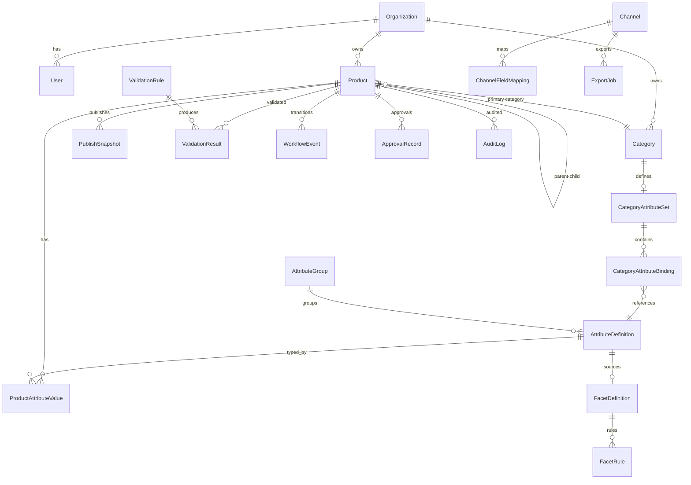

# Domain Model — Entity Relationship Outline

## Design Principles

1. **Product is the aggregate root** for catalog operations; variants are child entities.
2. **Attributes are schema-driven**, not column-per-attribute in the product table.
3. **Taxonomy drives validation**, not the reverse.
4. **Published data is immutable** via snapshots; working copy remains editable.
5. **Rules are first-class entities**, enabling configuration without code changes.
6. **All relationships are tenant-scoped.**

---

## Entity Groups

### Platform

```
Organization (Tenant)
├── id, name, slug, settings, createdAt
└── has many → User, Product, Category, ...

User
├── id, organizationId, email, name, status
└── has many → UserRole

Role
├── id, organizationId, name (Admin, Editor, Reviewer, ...)
└── has many → RolePermission

Permission
├── id, resource, action (product:edit, product:publish, ...)
```

### Catalog Core

```
Product
├── id, organizationId
├── productType: SIMPLE | PARENT | VARIANT | BUNDLE | COLLECTION
├── sku (unique per tenant; required for sellable types)
├── parentId → Product (nullable; set for VARIANT)
├── status: DRAFT | IN_REVIEW | APPROVED | PUBLISH_READY | PUBLISHED | ARCHIVED
├── title, description, brand
├── primaryCategoryId → Category
├── createdAt, updatedAt, createdBy, updatedBy
└── relationships:
    ├── has many → ProductAttributeValue
    ├── has many → ProductCategory (secondary categories)
    ├── has many → ProductMedia
    ├── has many → Product (children, if PARENT)
    ├── has many → ProductRelationship
    ├── has many → WorkflowEvent
    ├── has many → ValidationResult
    └── has many → PublishSnapshot

ProductRelationship
├── id, organizationId
├── sourceProductId → Product
├── targetProductId → Product
├── relationshipType: VARIANT_OF | BUNDLE_COMPONENT | ACCESSORY | REPLACEMENT | COLLECTION_MEMBER
├── quantity (for bundles)
└── sortOrder
```

### Taxonomy

```
Category
├── id, organizationId
├── parentId → Category (nullable for root)
├── name, slug, path (materialized, e.g. /apparel/mens/shirts)
├── depth, sortOrder, isActive
└── has one → CategoryAttributeSet

CategoryAttributeSet
├── id, categoryId
└── has many → CategoryAttributeBinding

CategoryAttributeBinding
├── id, categoryAttributeSetId
├── attributeDefinitionId → AttributeDefinition
├── requirement: REQUIRED | OPTIONAL | HIDDEN
├── inheritFromParent: boolean
└── sortOrder
```

### Attributes

```
AttributeGroup
├── id, organizationId
├── name, sortOrder
└── has many → AttributeDefinition

AttributeDefinition
├── id, organizationId
├── attributeGroupId → AttributeGroup
├── key (machine name, unique per tenant)
├── label, description, helpText
├── dataType: TEXT | RICH_TEXT | NUMBER | BOOLEAN | ENUM | DATE | URL | JSON
├── isGlobal: boolean (applies to all products)
├── constraints: JSON (min, max, regex, allowedValues ref)
├── isVariantAxis: boolean
└── has many → AttributeEnumValue (if ENUM)

AttributeEnumValue
├── id, attributeDefinitionId
├── value, label, sortOrder

ProductAttributeValue
├── id, productId, attributeDefinitionId
├── value: JSON (typed storage)
├── source: LOCAL | INHERITED | OVERRIDDEN
├── inheritedFromProductId → Product (nullable)
└── unique (productId, attributeDefinitionId)
```

### Facets

```
FacetDefinition
├── id, organizationId
├── key, label
├── sourceAttributeDefinitionId → AttributeDefinition
├── scope: GLOBAL | CATEGORY
├── categoryId → Category (nullable)
├── sortOrder, isActive
└── has many → FacetRule

FacetRule
├── id, facetDefinitionId
├── ruleType: DIRECT | NORMALIZE | RANGE_BUCKET | COMPOSITE
├── config: JSON (normalization map, bucket ranges, etc.)
└── priority

FacetValue (computed / materialized view)
├── facetDefinitionId, productId, displayValue, rawValue
└── indexed for category browse queries
```

### Governance

```
WorkflowEvent
├── id, productId
├── fromStatus, toStatus
├── actorId → User
├── comment, createdAt

ValidationRule
├── id, organizationId
├── name, description
├── scope: GLOBAL | CATEGORY | CHANNEL | PRODUCT_TYPE
├── scopeRefId (categoryId, channelId, etc.)
├── expression: JSON (rule DSL)
├── severity: BLOCKING | WARNING
├── isActive

ValidationResult
├── id, productId
├── validationRuleId → ValidationRule
├── status: PASS | FAIL | WARNING
├── message, fieldRef
├── evaluatedAt

ApprovalRecord
├── id, productId
├── reviewerId → User
├── decision: APPROVED | REJECTED | CHANGES_REQUESTED
├── comment, createdAt
```

### Publishing

```
PublishSnapshot
├── id, productId
├── version (incrementing)
├── snapshotData: JSON (full resolved product + attributes)
├── publishedAt, publishedBy
├── channelId → Channel (nullable for generic publish)
└── immutable after creation

Channel
├── id, organizationId
├── name, channelType: SHOPIFY | CUSTOM_JSON | CSV | API
├── config: JSON
└── has many → ChannelFieldMapping

ChannelFieldMapping
├── id, channelId
├── sourcePath (PIM field path, e.g. attributes.color)
├── targetField
├── transform: JSON (optional transform rule)

ExportJob
├── id, organizationId, channelId
├── status: PENDING | RUNNING | COMPLETED | FAILED
├── filter: JSON
├── startedAt, completedAt
└── has many → ExportJobResult
```

### Import / Operations

```
ImportJob
├── id, organizationId
├── sourceType: CSV | API | CONNECTOR
├── status, fileUrl, mappingConfig: JSON
├── totalRows, successCount, errorCount
└── has many → ImportJobRow

ImportJobRow
├── id, importJobId
├── rowNumber, sku, status, errors: JSON

AuditLog
├── id, organizationId
├── entityType, entityId
├── action: CREATE | UPDATE | DELETE | STATE_CHANGE | IMPORT | EXPORT
├── actorId → User
├── changes: JSON (field-level diff)
├── createdAt
```

---

## Relationship Diagram (Simplified)



---

## Parent-Child / Variant Inheritance Model

### Definitions

| Concept | Rule |
|---------|------|
| **Parent** | Holds shared content; may define variant axes |
| **Child (Variant)** | Must have `parentId`; must have SKU; must have values for all variant axes |
| **Inheritance** | On read/save, child inherits parent attribute values where child has no local value |
| **Override** | Child sets `source: OVERRIDDEN` when value differs from parent |
| **Local** | Child-only attribute not present on parent |

### Resolution Algorithm (Conceptual)

```
FOR each attribute in merged schema (global + category):
  IF child has ProductAttributeValue with source LOCAL or OVERRIDDEN:
    RETURN child value
  ELSE IF attribute is inheritable AND parent has value:
    RETURN parent value (mark source INHERITED)
  ELSE:
    RETURN null (may trigger validation error if required)
```

### Variant Axis Rules

- Variant axes are `AttributeDefinition` entries with `isVariantAxis = true`
- Defined at category level in `CategoryAttributeSet`
- Sibling variants must have unique combinations of axis values
- Parent cannot be publish-ready unless all expected children exist (configurable)

---

## Product Type Matrix

| Type | Sellable | Has Parent | Has Children | MVP |
|------|----------|------------|--------------|-----|
| SIMPLE | Yes | No | No | Yes |
| PARENT | Optional | No | Yes (variants) | Yes |
| VARIANT | Yes | Yes | No | Yes |
| BUNDLE | Yes | No | Components via relationship | Later |
| COLLECTION | No | No | Members via relationship | Later |

---

## Facet Generation (Conceptual)

```
INPUT:  Product P in Category C with attribute values
RULES:  FacetDefinitions active for C (or global)
FOR EACH facet F:
  rawValue = P.attributes[F.sourceAttribute.key]
  displayValue = apply(F.rules, rawValue)
  EMIT FacetValue(F, displayValue)
```

**MVP:** `DIRECT` rule only (attribute value = facet value)  
**Later:** normalization maps, range buckets, composite facets

---

## Publish Snapshot Contents

Immutable JSON document including:

- Core product fields (resolved)
- All attribute values (post-inheritance resolution)
- Category assignments and breadcrumb paths
- Media references
- Variant axis values
- Validation result summary at time of publish
- Schema version for forward compatibility

---

## Extensibility Hooks (Future)

| Hook | Purpose |
|------|---------|
| `ValidationRule.expression` | Custom rule DSL |
| `ChannelFieldMapping.transform` | Channel-specific transforms |
| `FacetRule.config` | Facet normalization |
| `ImportJob.mappingConfig` | Source-specific column maps |
| Event bus: `product.published` | Trigger integrations |

---

## Indexing Considerations (Planning Note)

- Unique: `(organizationId, sku)`
- Search: `(organizationId, status, title)` full-text
- Taxonomy: `(organizationId, category.path)`
- Audit: `(organizationId, entityType, entityId, createdAt)`
- Facets: `(organizationId, categoryId, facetDefinitionId, displayValue)`
