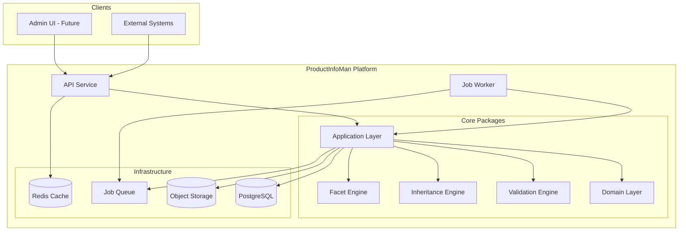
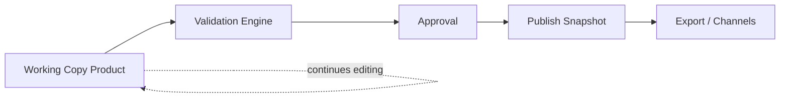
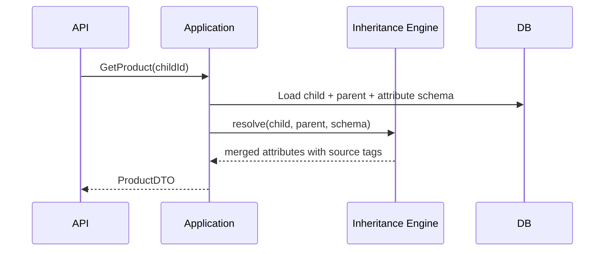
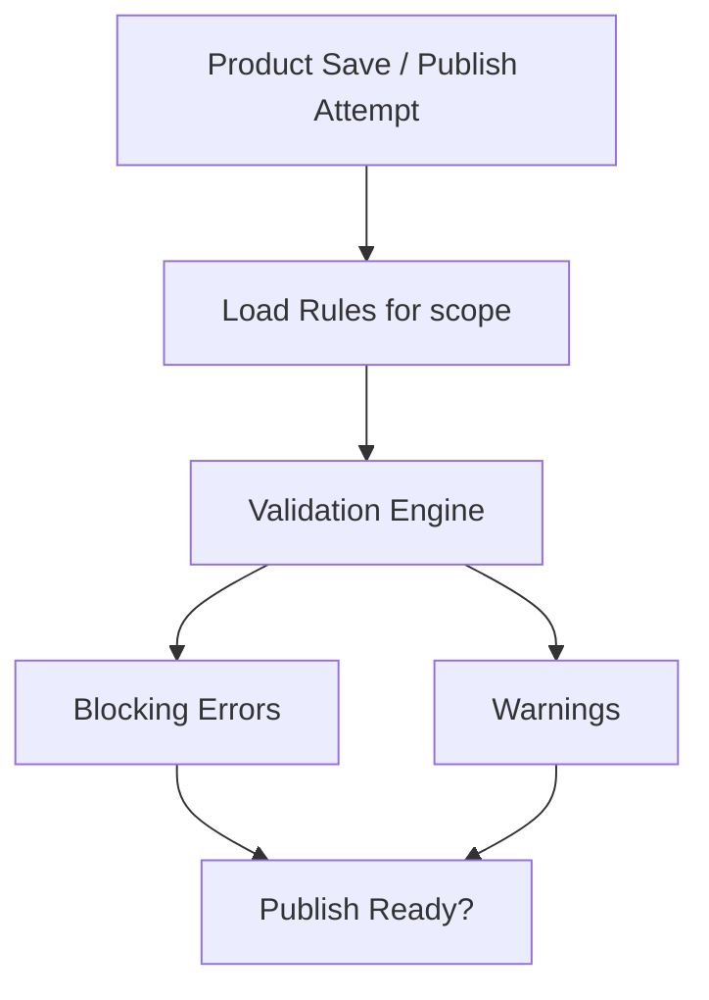
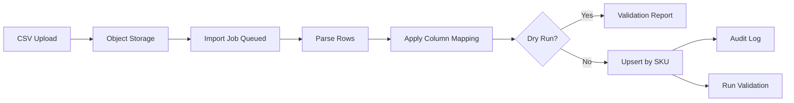
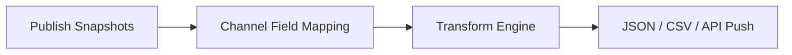
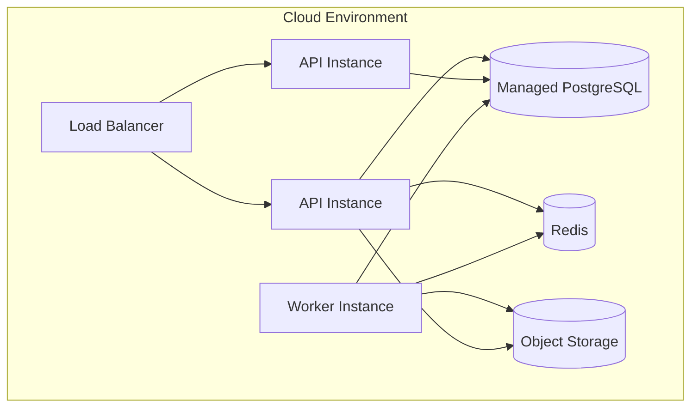
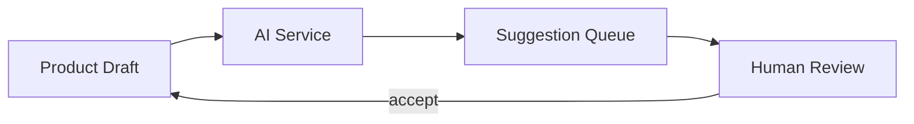

# Technical Architecture Outline

> Architecture planning only. No implementation in this phase.

---

## 1. Architecture Style

**Modular monolith** (MVP) with **clear package boundaries** to enable future extraction into services.

| Layer | Responsibility |
|-------|----------------|
| **Presentation** | REST API (`apps/api`), future Admin UI (`apps/web`) |
| **Application** | Use cases, orchestration, transaction boundaries |
| **Domain** | Entities, invariants, domain events |
| **Infrastructure** | Persistence, messaging, external adapters |
| **Engines** | Validation, inheritance, facet (config-driven, stateless) |

---

## 2. High-Level System Diagram



---

## 3. Core Architectural Decisions

| Decision | Choice | Rationale |
|----------|--------|-----------|
| Language | TypeScript | Type safety, shared types across stack |
| API style | REST + OpenAPI | Broad compatibility, clear contracts |
| Database | PostgreSQL | Relational integrity, JSONB for flexible attributes |
| ORM | Prisma 7 | Schema migrations, type-safe queries |
| Multi-tenancy | Row-level (`organizationId`) | Simpler MVP than schema-per-tenant |
| Async jobs | Queue-based worker | Import/export/validation at scale |
| File storage | S3-compatible object storage | CSV uploads, export artifacts |
| Auth | JWT (MVP); SSO later | Stateless API scaling |
| Rule config | DB-stored JSON + versioned schemas | No deploy for rule changes |
| Events | Internal event bus (in-process MVP) | Audit, async triggers; message broker later |

---

## 4. Multi-Tenancy Model

```
Request → Auth Middleware → Resolve organizationId from token
         → Tenant Middleware → Inject tenant context
         → All queries scoped by organizationId
```

**Assumption (A2):** Single database, shared tables, tenant column on all tenant-owned entities.

**Future option:** Schema-per-tenant or dedicated DB for enterprise tier — not MVP.

---

## 5. Product Data Architecture

### Working Copy vs Published Snapshot



- **Working copy:** mutable product record in `DRAFT` through `PUBLISH_READY`
- **Publish snapshot:** immutable JSON document at `PUBLISHED` transition
- Channel export reads snapshots only (never draft data)

### Attribute Storage (EAV Pattern)

```
AttributeDefinition (schema)  +  ProductAttributeValue (EAV values)
```

- Schema in relational tables for queryability
- Values in typed JSON column with `attributeDefinitionId` FK
- Facets computed from resolved attribute values (post-inheritance)

---

## 6. Variant Inheritance Architecture



**Inheritance Engine** is stateless:
- Input: parent values, child values, category attribute set, inheritance config
- Output: resolved attribute map with `LOCAL | INHERITED | OVERRIDDEN` metadata

---

## 7. Validation Architecture



**Rule scopes (evaluated in order):**
1. Global rules
2. Product type rules
3. Category attribute set requirements
4. Parent-child consistency rules
5. Channel rules (Phase 2)

**Rule expression format (MVP):** JSON config with typed rule kinds:
- `required`, `regex`, `minLength`, `maxLength`, `unique`, `crossField`, `variantAxisComplete`

**Future:** Expression DSL compiled to same evaluator.

---

## 8. Facet Architecture

**MVP:** Synchronous computation on read or async materialization on product save.

```
Product saved → Facet Engine → compute facets for product's categories → store FacetValue rows
```

**Facet rule types (phased):**
| Rule Type | Phase |
|-----------|-------|
| DIRECT | MVP |
| NORMALIZE | Phase 2 |
| RANGE_BUCKET | Phase 2 |
| COMPOSITE | Phase 3 |

---

## 9. Import Pipeline Architecture



**Idempotency:** Upsert keyed on `(organizationId, sku)`.

**Error handling:** Row-level errors collected; partial success allowed (configurable).

---

## 10. Export / Syndication Architecture (Phase 2)



**Transform engine:** Config-driven field path mapping with optional transform functions (uppercase, date format, concat).

**Connectors (plugin interface):**
```typescript
interface ChannelConnector {
  channelType: string;
  deliver(payload: ExportPayload, config: ChannelConfig): Promise<DeliveryResult>;
}
```

Implementations: `CustomJsonConnector`, `ShopifyConnector` (later).

---

## 11. Workflow & Audit Architecture

### State Machine

Enforced in application layer — not DB triggers.

```
transition(product, action, actor) →
  check permission(actor, action)
  check valid state transition
  run validation if required
  persist new state
  emit WorkflowEvent + AuditLog
```

### Audit Strategy

- **Synchronous:** audit row on every mutation (same transaction)
- **Field-level diff:** JSON patch of changed fields
- **Immutable audit log** — no updates or deletes

---

## 12. Security Architecture

| Concern | Approach |
|---------|----------|
| Authentication | JWT with short expiry + refresh tokens |
| Authorization | RBAC middleware per route + resource |
| Tenant isolation | `organizationId` on all queries; integration tests enforce |
| Data in transit | TLS everywhere |
| Data at rest | Encrypted DB volumes; encrypted object storage |
| Secrets | Environment / secrets manager |
| API rate limiting | Per-tenant rate limits on public API |
| Input validation | Zod/class-validator at API boundary |

---

## 13. Observability

| Signal | Tooling (proposed) |
|--------|-------------------|
| Logs | Structured JSON → centralized log aggregator |
| Metrics | Request latency, job duration, import success rate |
| Traces | OpenTelemetry across API and worker |
| Alerts | Failed import jobs, validation error spikes, API error rate |

---

## 14. Deployment Architecture (MVP)



**MVP deployment:** Single region, managed Postgres, containerized API + worker.

**Future:** Multi-region read replicas, dedicated worker pools per job type.

---

## 15. Integration Points (Future)

| Integration | Pattern | Direction |
|-------------|---------|-----------|
| Ecommerce (Shopify) | Connector + webhook | Outbound |
| ERP | Scheduled import job + API | Inbound |
| DAM | Asset reference + sync job | Inbound |
| AI Services | Async suggestion queue | Inbound |
| Data Warehouse | Snapshot export | Outbound |
| Webhooks (customer) | Event bus → HTTP POST | Outbound |

**Event catalog (internal):**
- `product.created`, `product.updated`, `product.submitted`, `product.approved`, `product.published`
- `import.completed`, `export.completed`, `validation.failed`

---

## 16. AI Enrichment Architecture (Phase 4 — Outline Only)



- AI never writes directly to published data
- Suggestions stored as proposals with confidence score
- Accept/reject audited with model version

---

## 17. Technology Stack Summary

| Layer | Technology |
|-------|------------|
| Runtime | Node.js 22 LTS |
| Language | TypeScript 5.x |
| API framework | Fastify or Hono (decision in ADR) |
| ORM | Prisma 7 + PostgreSQL |
| Validation (API) | Zod |
| Queue | BullMQ + Redis |
| Object storage | S3 / MinIO (local) |
| Monorepo | pnpm workspaces + Turborepo |
| Testing | Vitest + integration tests with Testcontainers |
| CI | GitHub Actions |
| Containers | Docker |

---

## 18. Architecture Decision Records (Planned)

| ADR | Topic | Status |
|-----|-------|--------|
| ADR-001 | Monorepo structure | Proposed |
| ADR-002 | Row-level multi-tenancy | Proposed |
| ADR-003 | EAV attribute storage | Proposed |
| ADR-004 | Publish snapshot immutability | Proposed |
| ADR-005 | Config-driven rule engines | Proposed |
| ADR-006 | API framework selection | Pending |
| ADR-007 | Queue technology | Pending |

---

## 19. Non-Goals (Architecture)

- Microservices in MVP
- Event sourcing for product data (audit log is sufficient)
- GraphQL API (REST first)
- Real-time collaborative editing
- Blockchain or distributed ledger for audit
