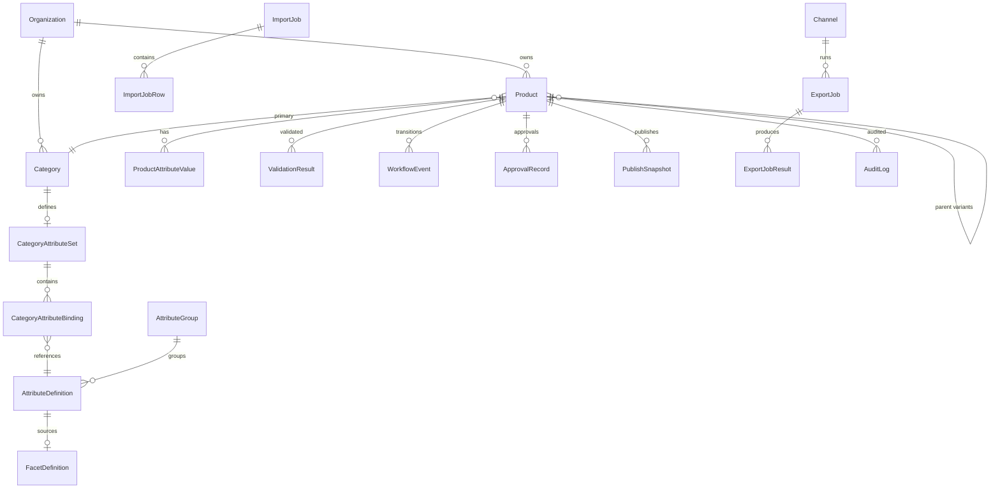

# Discovery & Domain Modeling Foundation

> **Phase:** 0 — Discovery and domain modeling  
> **Status:** First pass complete; workshops not yet run  
> **Constraint:** No features, UI, or production code in this phase

---

## Document Map

This is the master planning artifact for Phase 0. Detailed supplements:

| Section | Extended detail in |
|---------|-------------------|
| Discovery questions | [04-discovery-workshop.md](./04-discovery-workshop.md) |
| Service order | [08-service-implementation-roadmap.md](./08-service-implementation-roadmap.md) |
| Entity relationships | [03-domain-model.md](./03-domain-model.md) |

---

## 1. Discovery Questions

Run these with merchandising, ecommerce ops, data governance, and engineering before Sprint 1.

### 1.1 Source of Truth & Systems

| # | Question | Decision needed for |
|---|----------|---------------------|
| D1 | What is the source of truth for products today? | Integration design |
| D2 | What becomes source of truth after PIM launch? | Conflict resolution |
| D3 | Which systems must integrate in year 1? (ERP, Shopify, DAM) | Phase 2 scope |
| D4 | Who owns product data quality? | RBAC, workflow |

### 1.2 Product Types & Catalog Scale

| # | Question | Decision needed for |
|---|----------|---------------------|
| D5 | What product types exist? (Simple, Parent, Variant, Bundle, Collection) | Domain model |
| D6 | Are parent products sellable or display-only? | Variant rules |
| D7 | Current SKU count? Growth in 12 months? | Indexing, import scale |
| D8 | How many concurrent catalog editors? | Concurrency model |

### 1.3 Taxonomy & Attributes

| # | Question | Decision needed for |
|---|----------|---------------------|
| D9 | Existing category tree? Can it be exported? | Migration |
| D10 | Max category depth? | Schema constraints |
| D11 | Global vs category-specific attributes — list each | Attribute sets |
| D12 | Required attribute matrix per category? | Validation rules |
| D13 | Regulated attributes (compliance, hazmat)? | Approval gates |

### 1.4 Variants & Inheritance

| # | Question | Decision needed for |
|---|----------|---------------------|
| D14 | What defines parent vs child? | Relationship rules |
| D15 | Standard variant axes per category? (Color, Size) | `isVariantAxis` config |
| D16 | Which fields inherit from parent? | Inheritance engine |
| D17 | Which fields must be unique per child? | Override rules |
| D18 | SKU generation convention? | Import mapping |
| D19 | Block invalid variant combinations? | Validation |

### 1.5 Facets & Browse

| # | Question | Decision needed for |
|---|----------|---------------------|
| D20 | How are facets managed today? | Facet rule design |
| D21 | Top facets per major category? | MVP facet config |
| D22 | Facet value normalization needed at launch? | MVP vs Phase 2 |
| D23 | Facets differ per channel? | Channel mapping |

### 1.6 Validation & Publishing

| # | Question | Decision needed for |
|---|----------|---------------------|
| D24 | What blocks publishing today? | Blocking validation rules |
| D25 | Warnings allowed on publish? | Severity model |
| D26 | What does "published" mean? (live, export file, API) | Publishing service |
| D27 | Push vs pull to channels? | Async export design |
| D28 | MVP export target? (JSON file, Shopify, custom) | Channel config |

### 1.7 Workflow & Governance

| # | Question | Decision needed for |
|---|----------|---------------------|
| D29 | Who creates / edits / approves / publishes? | RBAC matrix |
| D30 | Single-step or multi-level approval for MVP? | Workflow service |
| D31 | Approval required for all edits or first publish only? | State machine |
| D32 | Audit retention period? | Audit service |

### 1.8 Import

| # | Question | Decision needed for |
|---|----------|---------------------|
| D33 | Primary onboarding method? (CSV, API, ERP) | MVP import format |
| D34 | Upsert key? (SKU, GTIN, external ID) | Idempotency |
| D35 | Partial import on row errors? | Import job behavior |
| D36 | Sample CSV available? | Mapping template |

### 1.9 MVP Boundary Sign-Off

| # | Question |
|---|----------|
| D37 | Target MVP launch date? |
| D38 | What is explicitly OUT of MVP? |
| D39 | Single brand or multi-brand per tenant? |
| D40 | SSO required at launch? |

**Workshop output:** Completed decision log in [04-discovery-workshop.md](./04-discovery-workshop.md#decision-log-template).

---

## 2. Assumptions

Labeled assumptions applied until discovery overrides them.

| ID | Assumption | Impact if wrong |
|----|------------|-----------------|
| A1 | PIM is SoR for merchandising attributes; ERP owns cost/inventory (sync later) | Re-scope integrations |
| A2 | MVP product types: SIMPLE, PARENT, VARIANT only | Add bundle work |
| A3 | Parent products are not sellable in MVP | SKU rules change |
| A4 | Row-level multi-tenancy (`organizationId` on all tenant data) | Enterprise isolation model |
| A5 | One catalog domain, one brand per tenant for MVP | Multi-brand schema |
| A6 | Single-step approval (Reviewer → Approved) | Workflow complexity |
| A7 | MVP import: CSV only, upsert by SKU | API import timing |
| A8 | MVP export: async JSON file to S3, one `CUSTOM_JSON` channel | Channel connector scope |
| A9 | Max 2 variant axes per category in MVP | Inheritance engine scope |
| A10 | English-only content; i18n modeled in schema, not implemented | Locale fields |
| A11 | PostgreSQL = write SoR; OpenSearch = disposable read model | Reindex strategy |
| A12 | Facets derived via DIRECT attribute mapping in MVP (no normalization) | Facet engine scope |
| A13 | Workflow service exclusively owns `Product.status` transitions | API ownership |
| A14 | Modular monolith (Fastify/NestJS modules), not microservices in MVP | Deployment |
| A15 | AI enrichment deferred; schema leaves room for suggestion queue | Phase 4 only |

---

## 3. Core Domain Model

### 3.1 Bounded Contexts

```
┌─────────────────┐   ┌──────────────────┐   ┌─────────────────┐
│  Catalog Core   │   │  Taxonomy &      │   │  Data Quality   │
│  (Product, SKU, │   │  Facets          │   │  (Import,       │
│   Variant)      │   │  (Category,      │   │   Validation)   │
│                 │   │   Attribute,      │   │                 │
│                 │   │   Facet)         │   │                 │
└────────┬────────┘   └────────┬─────────┘   └────────┬────────┘
         │                     │                      │
         └─────────────────────┼──────────────────────┘
                               │
         ┌─────────────────────┼──────────────────────┐
         │                     │                      │
┌────────▼────────┐   ┌────────▼─────────┐   ┌────────▼────────┐
│  Governance     │   │  Publishing    │   │  Operations     │
│  (Workflow,     │   │  (Snapshot,     │   │  (Audit,        │
│   Approval)     │   │   Channel       │   │   Reporting)    │
│                 │   │   Export)       │   │                 │
└─────────────────┘   └────────────────┘   └─────────────────┘
```

### 3.2 Core Aggregates

| Aggregate | Root Entity | Invariants |
|-----------|-------------|------------|
| **Product** | `Product` | SKU unique per tenant; variant must have parent; status changed only via Workflow |
| **Category** | `Category` | No circular hierarchy; materialized path |
| **Attribute Schema** | `AttributeDefinition` | Key unique per tenant; enum values consistent |
| **Category Schema** | `CategoryAttributeSet` | One set per category; bindings reference valid attributes |
| **Facet Config** | `FacetDefinition` | Source attribute must exist; scope global or category |
| **Import** | `ImportJob` | Validate before commit; idempotent on SKU |
| **Publish** | `PublishSnapshot` | Immutable after creation; only from PUBLISH_READY |
| **Export** | `ExportJob` | Async; channel-specific mapping; reads snapshots only |

### 3.3 Key Domain Rules

**Variant inheritance:**
```
FOR each attribute in effective schema:
  IF child has value with source OVERRIDDEN or LOCAL → use child value
  ELSE IF parent has value AND attribute is inheritable → use parent (INHERITED)
  ELSE → null (may fail validation if required)
```

**Facet derivation:**
```
FOR each active FacetDefinition in product's category scope:
  rawValue = resolvedProduct.attributes[facet.sourceAttribute.key]
  facetValue = apply(facet.rules, rawValue)   // MVP: DIRECT only
  EMIT to OpenSearch projection
```

**Publish readiness:**
```
PUBLISH_READY requires:
  status = APPROVED
  AND zero blocking ValidationResults
  AND all variant axes populated (if VARIANT)
  AND primary category assigned
```

**Import commit:**
```
FOR each row:
  validate(row, AttributeSchema, ProductRules)
  IF dry_run → collect errors only
  ELSE IF valid → upsert Product Core by SKU
  ELSE → skip row (partial success) OR fail job (configurable)
```

---

## 4. MVP Scope

### In MVP

| Area | Scope |
|------|-------|
| Product types | SIMPLE, PARENT, VARIANT |
| Relationships | Parent-child only; bundle/collection schema stubbed |
| Taxonomy | Full category tree; primary + secondary assignment |
| Attributes | Groups, definitions, category attribute sets, enums |
| Facets | DIRECT rules; projected to OpenSearch |
| Import | CSV, one mapping template, dry-run, upsert by SKU |
| Validation | Required, type, regex, category-bound, parent-child |
| Workflow | Draft → In Review → Approved → Publish Ready → Published |
| Approval | Single step |
| Publishing | Immutable snapshot; async JSON export to S3 |
| Channel | One `CUSTOM_JSON` target |
| Search | OpenSearch product index + facet filters |
| Audit | Product, workflow, import, publish events |
| Auth | JWT; roles: Admin, Catalog Manager, Editor, Reviewer, Viewer |

### Out of MVP

| Area | Phase |
|------|-------|
| Bundles, collections (functional) | Phase 3 |
| ERP / supplier connectors | Phase 2 |
| Live Shopify/API push | Phase 2 |
| Facet normalization | Phase 2 |
| Multi-level approval | Phase 2 |
| AI enrichment | Phase 4 |
| Localization UI | Phase 3+ |
| Supplier self-service | Phase 4 |
| SSO | Phase 2 |

### MVP Success Criteria

Catalog manager can: define taxonomy → import CSV with dry-run → manage variants with inheritance → submit/approve → reach publish-ready → publish snapshot → export JSON to S3 → browse/filter in OpenSearch → view audit trail.

---

## 5. Implementation Phases

| Phase | Name | Services | Outcome |
|-------|------|----------|---------|
| **0** | Discovery & modeling | — | Signed decision log, frozen domain model |
| **1** | Catalog foundation | Product Core, Taxonomy & Facet | CRUD + schema + inheritance |
| **2** | Data ingestion | Import & Validation | CSV pipeline, rules engine |
| **3** | Governance | Workflow & Approval | State machine, publish-ready gate |
| **4** | Read models | Search Projection | OpenSearch index + browse API |
| **5** | Distribution | Publishing & Syndication | Snapshots, JSON export |
| **6** | Observability | Audit & Reporting | Full audit + reports |
| **7** | Hardening | Integration & Eventing | Outbox, webhooks, OTel |
| **8** | Operations UI | Admin UI (last) | End-to-end flows in browser |

**Dependency rule:** Never start a phase until the prior phase APIs and events are stable.

---

## 6. Service Boundaries

| Service | Owns (SoR) | Reads from | Writes to |
|---------|------------|------------|-----------|
| **Product Core** | Product, SKU, ProductAttributeValue, ProductRelationship, ProductMedia | Taxonomy (category exists) | PostgreSQL |
| **Taxonomy & Facet** | Category, Attribute*, FacetDefinition, FacetRule | — | PostgreSQL |
| **Import & Validation** | ImportJob, ValidationRule, ValidationResult | Product Core, Taxonomy | Product Core (via API) |
| **Workflow & Approval** | WorkflowEvent, ApprovalRecord | ValidationResult, Product | Product.status only |
| **Search Projection** | OpenSearch documents | Product Core, Taxonomy | OpenSearch |
| **Publishing & Syndication** | PublishSnapshot, Channel, ExportJob | Product Core, Taxonomy, Workflow | PostgreSQL, S3 |
| **Audit & Reporting** | AuditLog, DailyMetricRollup | All events | PostgreSQL |
| **Integration & Eventing** | Outbox, WebhookSubscription | Outbox | BullMQ, HTTP webhooks |
| **Admin UI** | — | All APIs | — |

**Cross-cutting:** `Organization`, `User`, `Role` owned by platform auth module (Sprint 1).

---

## 7. Data Entities and Relationships

### 7.1 Entity Catalog

| Entity | Description | Owner Service |
|--------|-------------|---------------|
| **Product** | Master catalog record; types SIMPLE, PARENT, VARIANT | Product Core |
| **SKU** | Unique sellable identifier (`Product.sku`) | Product Core |
| **Variant** | Child Product with `parentId` + axis values | Product Core |
| **Category** | Node in taxonomy hierarchy | Taxonomy |
| **Attribute** | `AttributeDefinition` — typed field schema | Taxonomy |
| **Attribute Group** | UI/logical grouping of attributes | Taxonomy |
| **Facet** | `FacetDefinition` + rules → browse dimension | Taxonomy |
| **Workflow State** | `Product.status` enum lifecycle | Workflow |
| **Approval** | `ApprovalRecord` — decision + comment | Workflow |
| **Channel Export** | `Channel` + `ExportJob` + S3 artifact | Publishing |
| **Import Job** | `ImportJob` + row-level results | Import |
| **Audit Log** | Append-only change history | Audit |

### 7.2 Relationship Matrix

| From | To | Cardinality | Notes |
|------|-----|-------------|-------|
| Product | Product (parent) | N:1 | VARIANT only |
| Product | Product (children) | 1:N | PARENT only |
| Product | Category | N:1 primary, N:M secondary | |
| Product | ProductAttributeValue | 1:N | EAV storage |
| ProductAttributeValue | AttributeDefinition | N:1 | Typed by schema |
| Category | Category (parent) | N:1 | Tree |
| Category | CategoryAttributeSet | 1:1 | |
| CategoryAttributeSet | AttributeDefinition | N:M via binding | required/optional/hidden |
| AttributeDefinition | AttributeGroup | N:1 | |
| FacetDefinition | AttributeDefinition | N:1 | Source attribute |
| FacetDefinition | Category | N:1 optional | Scope |
| Product | ValidationResult | 1:N | Latest per rule |
| Product | WorkflowEvent | 1:N | State history |
| Product | ApprovalRecord | 1:N | |
| Product | PublishSnapshot | 1:N | Versioned |
| ExportJob | Channel | N:1 | |
| ImportJob | ImportJobRow | 1:N | |

### 7.3 ER Diagram



### 7.4 Table Creation Order

| Sprint | Tables |
|--------|--------|
| 1 | `Organization`, `User`, `Role`, `Product`, `ProductAttributeValue`, `ProductCategory`, `ProductMedia`, `ProductRelationship` |
| 2 | `Category`, `AttributeGroup`, `AttributeDefinition`, `AttributeEnumValue`, `CategoryAttributeSet`, `CategoryAttributeBinding`, `FacetDefinition`, `FacetRule` |
| 3 | `ImportJob`, `ImportJobRow`, `ImportMappingTemplate`, `ValidationRule`, `ValidationResult` |
| 4 | `WorkflowEvent`, `ApprovalRecord` |
| 5 | `SearchIndexCursor` (+ OpenSearch index) |
| 6 | `PublishSnapshot`, `Channel`, `ChannelFieldMapping`, `ExportJob`, `ExportJobResult` |
| 7 | `AuditLog`, `DailyMetricRollup` |
| 8 | `Outbox`, `WebhookSubscription`, `WebhookDelivery`, `ProcessedEvent` |

---

## 8. Event Contract Outline

### 8.1 Envelope (all events)

```typescript
{
  eventId: string;           // UUID, idempotency key
  eventType: string;         // dot.notation
  eventVersion: number;      // start at 1
  organizationId: string;
  occurredAt: string;        // ISO 8601
  correlationId: string;     // traces request chain
  causationId?: string;      // parent eventId
  actorId?: string;
  payload: Record<string, unknown>;
}
```

### 8.2 Event Catalog (by introduction order)

| Order | Event | Producer | Consumers | Payload highlights |
|-------|-------|----------|-----------|-------------------|
| 1 | `product.created` | Product Core | Audit, Search | `productId`, `sku`, `productType`, `status` |
| 2 | `product.updated` | Product Core | Audit, Search | `productId`, `changedFields[]` |
| 3 | `product.deleted` | Product Core | Audit, Search | `productId` |
| 4 | `product.attributes_changed` | Product Core | Audit, Search, Validation | `productId`, `attributeKeys[]` |
| 5 | `category.updated` | Taxonomy | Search | `categoryId`, `path` |
| 6 | `category_attribute_set.changed` | Taxonomy | Validation, Search | `categoryId` |
| 7 | `facet_rule.changed` | Taxonomy | Search | `facetDefinitionId`, `categoryId` |
| 8 | `import.started` | Import | Audit | `importJobId`, `rowCount` |
| 9 | `import.completed` | Import | Audit, Report | `successCount`, `errorCount` |
| 10 | `validation.failed` | Import | Workflow | `productId`, `errors[]` |
| 11 | `validation.passed` | Import | Workflow | `productId` |
| 12 | `product.submitted` | Workflow | Audit | `productId`, `actorId` |
| 13 | `product.approved` | Workflow | Audit | `productId`, `approverId` |
| 14 | `product.publish_ready` | Workflow | Search, Publishing | `productId` |
| 15 | `product.published` | Publishing | Audit, Search, Integration | `productId`, `snapshotId`, `version` |
| 16 | `export.completed` | Publishing | Audit, Integration | `exportJobId`, `artifactUrl`, `productCount` |
| 17 | `export.failed` | Publishing | Audit | `exportJobId`, `reason` |

### 8.3 Delivery Model

| Phase | Mechanism |
|-------|-----------|
| Sprint 1–7 | In-process event bus (typed) |
| Sprint 8 | Transactional outbox → BullMQ → consumers |
| Phase 2+ | Webhook HTTP POST with HMAC signature |

### 8.4 Idempotency

| Consumer | Key |
|----------|-----|
| Search indexer | `(organizationId, productId, eventId)` |
| Audit writer | `eventId` |
| Webhook delivery | `eventId` |
| Import upsert | `(organizationId, sku)` |

---

## 9. Repo / Folder Structure

```
productinfoman/
├── apps/
│   ├── api/                              # Fastify or NestJS host
│   │   └── src/modules/
│   │       ├── platform/                 # Org, User, Role, auth
│   │       ├── product-core/
│   │       ├── taxonomy-facet/
│   │       ├── import-validation/
│   │       ├── workflow-approval/
│   │       ├── search-projection/
│   │       ├── publishing-syndication/
│   │       ├── audit-reporting/
│   │       └── integration-eventing/
│   ├── worker/                           # BullMQ processors
│   │   └── src/processors/
│   └── web/                              # Next.js — Phase 8 ONLY
├── packages/
│   ├── contracts/                        # Zod schemas, event types, DTOs
│   ├── domain/                           # Pure domain types per context
│   ├── db/                               # Prisma schema + client
│   ├── inheritance-engine/               # Parent-child resolver
│   ├── validation-engine/                # Rule evaluator
│   ├── facet-engine/                     # Facet computer
│   └── api-client/                       # Generated from OpenAPI
├── prisma/
│   ├── schema.prisma
│   └── migrations/
├── docs/
│   ├── planning/                         # Phase 0 artifacts (this doc)
│   ├── adr/                              # Architecture decisions
│   └── openapi/
├── docker/
│   └── docker-compose.yml                # PG, Redis, OpenSearch, MinIO
├── package.json
├── pnpm-workspace.yaml
└── turbo.json
```

**Module rules:**
- `domain` imports nothing from `apps` or `infrastructure`
- `contracts` is the only shared package for cross-module types
- Each service module owns its routes + application logic
- Workers import processors; no duplicate business logic in workers

---

## 10. Next Build Steps

### Phase 0 Exit Criteria (before Sprint 1 code)

- [ ] Discovery workshops completed (D1–D40 answered)
- [ ] Decision log signed off
- [ ] MVP scope confirmed by stakeholders
- [ ] Attribute matrix sample for 2–3 categories documented
- [ ] Sample CSV import file agreed
- [ ] Export JSON schema for MVP channel agreed

### Exact Next 10 Cursor Tasks

| # | Task | Output | Blocks |
|---|------|--------|--------|
| **1** | **Run discovery workshop** — fill decision log for D1–D40 | `docs/planning/decision-log.md` | Everything |
| **2** | **Freeze MVP attribute matrix** — global + 2 category examples | `docs/planning/mvp-attribute-matrix.md` | Validation rules |
| **3** | **Define MVP CSV column spec** — headers, types, parent SKU column | `docs/planning/mvp-import-spec.md` | Import mapping |
| **4** | **Define MVP export JSON schema** — channel payload shape | `docs/planning/mvp-export-schema.json` | Channel mapping |
| **5** | **Write ADR-001: modular monolith + Fastify vs NestJS** | `docs/adr/001-runtime-framework.md` | Scaffold |
| **6** | **Scaffold monorepo** — pnpm, `apps/api`, `apps/worker`, `packages/contracts`, `packages/db`, Docker Compose (PG, Redis) | Runnable `pnpm dev` skeleton | Product Core |
| **7** | **Prisma schema Sprint 1 tables** — Organization, Product, ProductAttributeValue | Migration applied | Product APIs |
| **8** | **Product Core module** — CRUD + Zod + SKU uniqueness + OpenAPI | `/v1/products` working | Taxonomy |
| **9** | **Inheritance engine package** — unit tests, no API yet | `packages/inheritance-engine` tests green | Variants |
| **10** | **Variant APIs + events** — create child, list children, `product.*` events | Variant flow end-to-end | Taxonomy sprint |

**Do not start tasks 6–10 until tasks 1–4 are complete** (or explicitly waived with labeled assumptions).

---

## Appendix: Product Concept Reference

| Concept | Implementation | Notes |
|---------|----------------|-------|
| Product | `Product` table | Aggregate root |
| SKU | `Product.sku` | Unique per `(organizationId, sku)` |
| Variant | `Product` where `productType=VARIANT` | Has `parentId` |
| Category | `Category` table | Materialized path |
| Attribute | `AttributeDefinition` | Schema, not value |
| Attribute Group | `AttributeGroup` | Organizational |
| Facet | `FacetDefinition` + `FacetRule` | Derived; not manually stored per product in PG |
| Workflow State | `Product.status` | Owned by Workflow module |
| Approval | `ApprovalRecord` | Linked to product + reviewer |
| Channel Export | `ExportJob` → S3 artifact | Async via BullMQ |
| Import Job | `ImportJob` | Validate-then-commit |
| Audit Log | `AuditLog` | Append-only; field diffs |

---

## Status Tracker

| Artifact | Status |
|----------|--------|
| Discovery questionnaire | Ready |
| Assumptions | First pass (15 labeled) |
| Domain model | First pass |
| MVP scope | Proposed — pending sign-off |
| Implementation phases | Defined (0–8) |
| Service boundaries | Defined |
| Entity relationships | Defined |
| Event contract | Defined (17 events) |
| Repo structure | Proposed |
| Next build steps | 10 tasks defined |
| Decision log | **Not started** |
| MVP attribute matrix | **Not started** |
| MVP import spec | **Not started** |
| MVP export schema | **Not started** |

**Gate to implementation:** Complete Cursor tasks 1–4 and obtain stakeholder sign-off on MVP scope.
